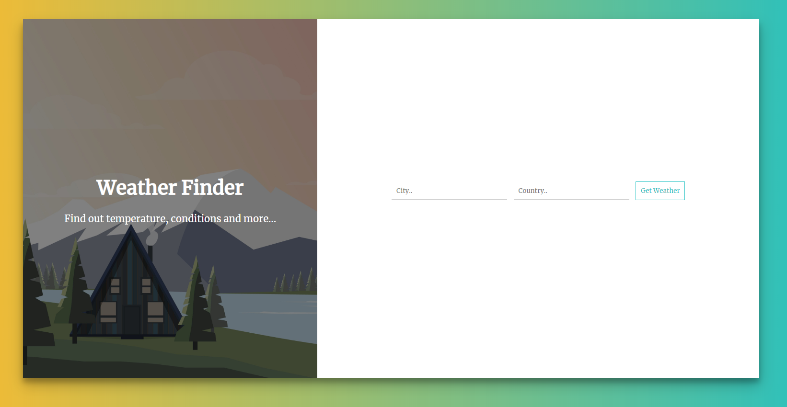
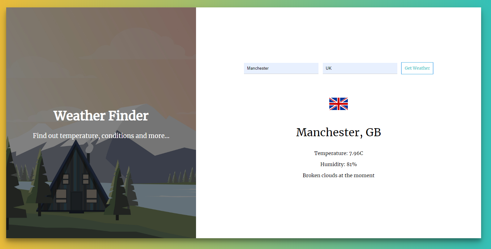

# Weather Finder
Wheather Finder is a ReactJS web appplication that tells you the current weather in a certain location

## Live demo:

[Click here](https://sirwhiz.github.io/weather-finder/) to see a live demo of the project

## Installation

Download the code from the repository, install it with npm by running the following command:

### `npm install`

And then just start the local React server by typing:

### `npm start`

## Screenshots:

## Technology Stack
This project was built using ReactJS

## Contributing
All pull requests are welcome.

## License
[MIT](https://choosealicense.com/licenses/mit/)
